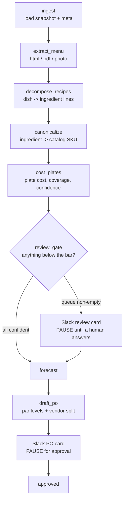

# Day Zero — a restaurant's public URL to a draft opening order

A restaurant on day one has no POS history. Every back-of-house system that
matters — par levels, prep sheets, the opening purchase order — is blocked on
sales data that does not exist yet, which is why onboarding a new site is
measured in days of manual work rather than minutes.

This is an experiment in how far you can get from a restaurant's **public
website alone**: read the menu, decompose each dish into ingredients, match
those ingredients to a priced SKU catalog, cost every plate, build a cold-start
demand prior from public signals, and draft an opening purchase order — pausing
for a human in Slack wherever the system is not confident enough to proceed.

It is a demo, not a product. The limits are stated in full below, and they are
not buried.

**[`TEARDOWN.md`](TEARDOWN.md) is the two-page version of this repo** — what I
built, what the validation harness found, and what I got wrong. Start there.

## What it does, end to end



`uv run python -m scripts.render_graph` prints the real compiled topology. It
looks nothing like the diagram above, and that is expected: the router is a
conditional edge attached to *every* node, so the generated graph is a complete
digraph. The diagram above is the logical flow; the generated one is the wiring
that makes the flow resumable from any node.

**The interesting part is the confidence plumbing, not the pipeline.** Every
node emits a `confidence` in `[0, 1]`. Plate-cost confidence is the geometric
mean of recipe confidence and mean SKU-match confidence — two model
self-assessments — *multiplied* by ingredient coverage, which is a measurement
rather than an opinion and so scales the result instead of being averaged into
it. Coverage therefore caps the answer outright: a plate costed from half its
ingredients reports at most half the confidence, no matter how sure the model
was about the half it saw. Anything below the bar goes to a human instead of
being guessed at.

## Run it

```powershell
uv sync
Copy-Item .env.example .env      # fill in ANTHROPIC_API_KEY at minimum

# One restaurant, full run (pauses at the Slack gates)
uv run python -m scripts.run_dayzero madame-vo

# Stop after costing: no forecast, no PO, no Slack, no human gates
uv run python -m scripts.run_dayzero joes-pizza-carmine --dry-run --no-slack

# What does the checkpoint hold for a paused run?
uv run python -m scripts.run_dayzero madame-vo --resume-status

uv run pytest                    # 356 tests
```

The run narrates itself — one line per completed stage carrying that stage's
headline number. When it reaches a human gate it prints the pause and **exits
0**; resumption happens in a different process:

```powershell
uv run uvicorn src.server.app:app --reload        # webhook server
cloudflared tunnel --url http://localhost:8000    # expose it to Slack
```

A Slack button click hits `/slack/interactions`, which resumes the paused graph
with `Command(resume=...)` from the SQLite checkpoint. There is deliberately no
polling loop in the CLI: duplicating the resume path would collapse the
two-process design into one and give the checkpointer nothing to do.

### Validation harness

```powershell
uv run python -m scripts.validate_foodcost          # corpus sweep + statistics
uv run python -m scripts.plot_foodcost              # -> foodcost-distribution.png
uv run python -m scripts.sweep_report --top-failures 15
```

## What is real and what is not

Being precise about this is the point, so it gets its own section rather than a
footnote.

| Component | Status |
|---|---|
| Menu extraction from real snapshots | **Real.** 20 NYC independents, fetched live and committed — 14 html, 5 pdf, 1 photographed menu. |
| Recipe decomposition, canonicalization, costing | **Real.** LLM calls against the committed snapshots, no mocking outside tests. |
| SKU price catalog (324 SKUs) | **Hand-curated, not a live feed.** Prices are plausible NYC wholesale, hand-authored for this project. Every `price_per_uom` is computed in the merge script, never typed by hand. |
| `popular_times_index`, `review_count` | **Observed** for 13/20 and 15/20 respectively, read from Google Maps. The rest are estimates, labelled as such in each `meta.json`. |
| `seats` | **Estimated for all 20.** |
| Demand forecast | **A cold-start prior, not a forecast**, and marked `method: "cold_start_prior"` wherever it appears. Built from seats, service style, price tier, popular-times shape and review volume. |
| Convergence curve | **Synthetic actuals**, seeded `random.Random(42)` and labelled synthetic on the chart itself. It demonstrates the shrinkage mechanism, which is deterministic arithmetic — it is not a measured result. |
| Slack HITL | **Real**, but needs a working bot token and a public tunnel. |

### What this does not prove

The food-cost chart exercises **the costing chain** — extraction, decomposition,
canonicalization and unit maths — and its headline result is a **miss**: median
implied food cost 8.2% over 519 plates, against an industry band of 28–33%.
That gap is the finding, not a failing grade. The band is *actual* food cost
(purchases over revenue, weighted by what sells, including waste and staff
meals); the chart plots an unweighted median of *theoretical* plate cost over
every priced menu line, high-margin sides and drinks included. The two are not
like-for-like. What survives the comparison is what the harness genuinely
establishes: unit conversions resolve, coverage is measured, and individual
plate costs check out by hand. `data/output/findings.md` works through it.

None of it says anything about the demand prior. There is no POS data here to
check a forecast against, and any claim otherwise would be fabricated.

### Known limits

- **Volume-to-weight and weight-to-count conversions are refused, not guessed.**
  An ingredient measured in `fl_oz` against a SKU priced per `lb` needs a
  density the catalog does not carry, so the line is dropped and coverage falls.
  This is deliberate — a wrong number that looks right is worse than an honest
  gap — but it is the single largest source of lost coverage.
- **Two corpus PDFs are scanned images with no text layer.** The loader detects
  this and says exactly what to do rather than silently extracting nothing.
- **Two corpus restaurants publish no prices at all** (`mamouns-falafel`,
  `rubirosa`), so they cannot contribute a food-cost ratio however cleanly they
  cost. Three more publish some unpriced lines, which drop out individually.
- Not multi-tenant, no auth, no rate limiting, no observability beyond stdout.

## Layout

| Path | What lives there |
|---|---|
| `src/state.py` | `AgentState` — the single source of truth for what flows between nodes |
| `src/graph.py` | Topology. Touch only when adding or removing a node. |
| `src/nodes/router.py` | Pure `state -> next_node_name`. No I/O, no exceptions. Read this first. |
| `src/nodes/` | One file per node. No node imports another node. |
| `src/tools/` | Snapshot loading, document parsing, blending. Tools never import nodes. |
| `src/slack/` | Block builders, signature verification, client. Knows nothing about LLMs. |
| `scripts/` | CLI entrypoints and the analysis harness |
| `data/restaurants/` | The committed corpus, one directory per restaurant |
| `plans/marble/` | Step-by-step build plan — one file per step, referenced by number from several source docstrings |

Two rules hold throughout: **the router is pure**, and **the circuit breaker is
absolute** (`retry_count >= MAX_RETRIES` forces a route to the human gate,
always).

## Stack

Python 3.11, LangGraph, langchain-anthropic (Anthropic is the only LLM provider),
FastAPI, slack-sdk, pydantic, httpx, pypdf. matplotlib is a dev-only dependency
for the analysis charts.
