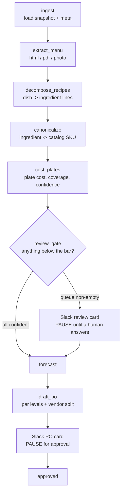

# Day Zero: a restaurant's public URL to a draft opening order

## What I looked at

Onboarding a restaurant onto a back-of-house system is measured in days of
manual work, and day one resists automation hardest. Everything downstream (par
levels, prep sheets, the opening purchase order) is blocked on a demand
forecast, and a forecast wants POS history that a site opening next Tuesday does
not have. Someone hand-maps menus, recipes, vendors and par levels before the
system can say anything at all.

So I took that constraint literally and asked how far you can get from a
restaurant's public website alone. No POS, no site visit, no invoice history.
Twenty NYC independents, fetched live and committed to the repo: 14 HTML menus,
5 PDFs, 1 photographed menu.

## What I built

A LangGraph state machine reads the snapshot, extracts the menu, decomposes each
dish into ingredient lines, matches each line to a priced SKU in a 324-SKU
catalog, costs every plate, builds a cold-start demand prior from seats and
public signals, and drafts an opening purchase order. The interesting part is
not the pipeline, it is the confidence plumbing: every node emits a confidence,
and plate-cost confidence is the *product* of recipe confidence, mean SKU-match
confidence and ingredient coverage rather than their average, so a plate costed
from half its ingredients cannot report high confidence however sure the model
was about the half it saw. Anything under the bar pauses the graph with
`interrupt()` and goes to a human in Slack; a button click hits a FastAPI
webhook and resumes the run from a SQLite checkpoint in a different process.
Canonicalization runs three passes, alias then normalized then the model, so
most ingredients never cost a model call at all. Across the sweep that is 199 LLM
calls, 64.3% of input tokens read from cache, and about $1.10 per restaurant.

## What I found

**The food-cost validation came back red, and the benchmark is what is wrong.**
I built a harness to check implied food cost (plate cost over menu price)
against the industry's 28-33% band, fixing the band before seeing any numbers.
It came back at a median of **7.8%** over 519 plates from 12 restaurants. None
of the obvious causes held: portions are realistic, chicken breast at $3.15/lb
and ribeye at $12.95/lb are real wholesale numbers, and coverage is 0.81-1.00
nearly everywhere. Then I costed a plate by hand. Au Za'atar's "Vermicelli Rice"
is $8, decomposes to 4 oz rice, 0.5 oz glass noodles, butter and salt, and costs
$0.39. That is *correct*. An $8 rice side really does run about 5% food cost.
The 28-33% band is *actual* food cost: purchases over revenue, weighted by what
sells, including waste and staff meals.
I was computing an unweighted median of *theoretical* plate cost across every
menu line, $12 fries included. The two are not comparable, and no amount of
tuning upstream would have made them comparable.

**There is a real under-costing hiding underneath it.** 844 of 879 recipes carry
`yield_qty: 1.0`. Au Za'atar's "Mixed Grill Taweel" is a $318 platter that
decomposes to 1.80 kg of meat costing $18.95, a single serving's quantities
against an eight-person price. Real, but second-order: it moves tens of plates,
not the 519 that set the median.

**The catalog gap is a cuisine gap.** `court-street-grocers` could not match 42
of 89 ingredients (47.2%): `seeded hero roll`, `corned beef`, `hoagie spread`,
`vegan comeback sauce`. `kanoyama` fails the same way in Japanese: `ankimo`,
`ikura`, `gobo`, `kanpyo`. This is what a fixed catalog meeting a cuisine it
does not cover looks like on day one — and it is a per-cuisine cost, not a
one-off.

**The bigger coverage loss is conversions, not missing SKUs.** `roasted nori
sheets` is dropped on 41 plates because the catalog has no each-to-lb weight for
it; `canned san marzano whole tomatoes` on 27; `peeled garlic cloves` on 21.
Four numbers in `skus.json` would lift 109 plates. The system refuses these
rather than guessing a density, which I still think is right.

## What I'd do next, and what I got wrong

The methodology error above is mine, and it was in the plan from the start. I
wrote the benchmark comparison before I understood the difference between
theoretical and actual food cost. The right fix is a sales-mix-weighted
theoretical cost restricted to entrees, compared against a theoretical band, and
that needs exactly the POS data this project set out not to use. So I left the
red result on the chart and explained it, because a harness that returns a
number and correctly diagnoses its own methodology is worth more than one that
returns a clean 31%.

Next: fix `yield_qty` in the decomposer, add per-SKU densities for the four
conversion offenders, and route non-food menu lines around the decomposer.
`bubbys-tribeca` extracted 164 items and decomposed 125 of them before dying on
an apron and a cookbook.

Six of twenty restaurants did not complete and I am out of budget to retry them.
`di-an-di` and `tacombi` are scanned PDFs with no text layer; the loader detects
that and names the fix instead of extracting nothing. `fonda-park-slope` and
`junoon` blew the output token ceiling mid-structure; I raised the limit and
disabled thinking on the mechanical nodes but never re-ran them. `veselka` hit
my own spend cap.

The honest limits: SKU prices are hand-curated plausible NYC wholesale, not a
live feed. `seats` is estimated for all twenty; popular-times is observed for
13. The convergence curve uses **synthetic actuals** with a seeded RNG and says
so on the chart: it demonstrates the shrinkage arithmetic, it is not a measured
result. The demand forecast is a cold-start prior labelled
`method: "cold_start_prior"` everywhere it appears. Nothing here validates a
forecast; that would need real POS history from live sites.
